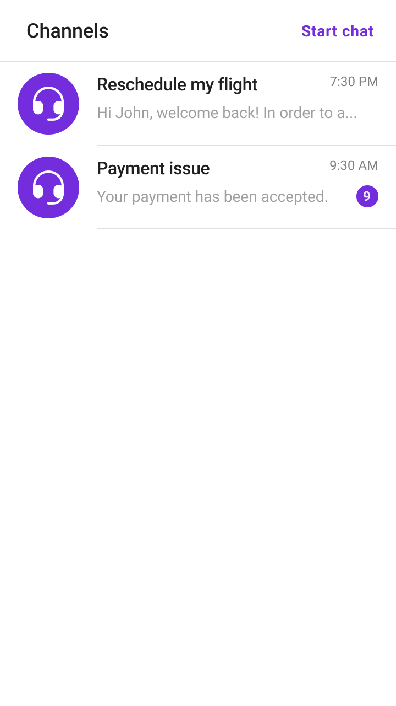
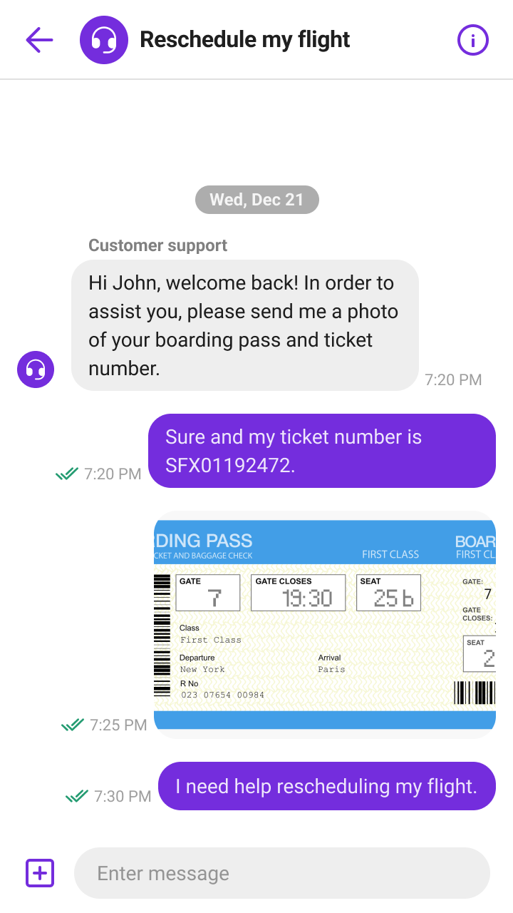
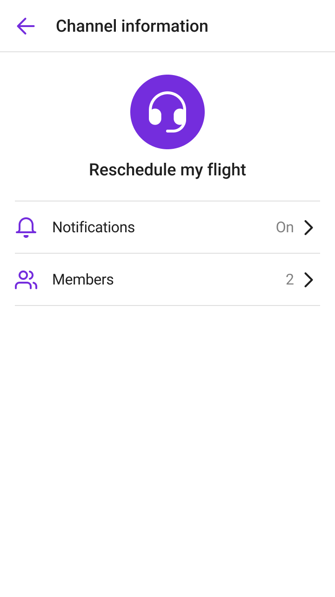

# Sendbird Support Chat Sample for Android
This is an example of [Sendbird Support Chat](https://sendbird.com/docs/support-chat/v1/overview) for Android, implemented using [Sendbird UIKit](https://sendbird.com/docs/uikit/v3/android/overview).
<p>
Sendbird Support Chat: Salesforce Connector is a Sendbird Chat integration into your existing Salesforce Service Cloud that offers support focused chat experience with vast new features for agent productivity. With this Support Chat Salesforce sample app, you can quick start your client-side implementation.
</p>

<p align="center">
  
  
  
</p>


## Getting Started
1. Create your Sendbird application on [the dashboard](https://dashboard.sendbird.com/auth/signup).
2. [Install the Salesforce Connector package](https://sendbird.com/docs/support-chat/v1/salesforce-connector/integrate-with-salesforce-service-cloud) in your Salesforce organization. Please complete the necessary configuration by following the documentation.
3. In this example, we're connecting to a test purpose Sendbird application and a Salesforce organization. To connect yours, replace `APP_ID` and others in the `BaseApplication.kt` file as follows:

```kotlin
class BaseApplication : Application() {
    companion object {
        // TODO Replace with your own APP_ID
        const val APP_ID = "13B6D179-33A5-4C0D-9162-E11DAC9358FC"

        // TODO Replace with your own USER_ID
        const val USER_ID = "sendbird"

        // TODO Replace with your own NICKNAME
        const val NICKNAME = "sendbird"

        // TODO Replace with your own PROFILE_URL
        const val PROFILE_URL = ""

        // ...
    }

    // ...
}

```
4. Run `app`

## How to connect a channel to a case
In this example, we built a simple serverless endpoint on the Salesforce side to create a case. You can use the most popular way, the [Salesforce Rest API](https://developer.salesforce.com/docs/atlas.en-us.api_rest.meta/api_rest/intro_rest.htm), or refer to [our documentation](https://sendbird.com/docs/support-chat/v1/salesforce-connector/integrate-with-salesforce-service-cloud#2-step-5-client-side-implementation-3-create-a-case-through-apex-rest-api) to create a simple endpoint. To connect a channel to a case, you can do the following:

1. Create a channel with custom type: `SALESFORCE_SUPPORT_CHAT_CHANNEL`

```kotlin
private fun createGroupChannel(title: String) {
    val params = GroupChannelCreateParams()
    params.customType = "SALESFORCE_SUPPORT_CHAT_CHANNEL"
    params.userIds = listOf(SendbirdUIKit.getAdapter().userInfo.userId)
    // optional
    params.name = title
    // optional
    params.coverImage = createUserAgentCoverImage()
    GroupChannel.createChannel(params) { groupChannel, e ->
        if (e != null) {
            toastError("Couldn't start support chat")
            return@createChannel
        } else if (groupChannel != null) {
            startChat(groupChannel)
        }
    }
}
```

2. Create a case with fields from Salesforce Connector.


```kotlin
private fun startChat(channel: GroupChannel) {
    val json = "{\"subject\":\"${channel.name}\"," +
            "\"suppliedName\":\"${SendbirdUIKit.getAdapter().userInfo.nickname}\"," +
            "\"sendbirdUserId\":\"${SendbirdUIKit.getAdapter().userInfo.userId}\"," +
            "\"sendbirdChannelURL\":\"${channel.url}\"," +
            "\"isEinsteinBotCase\":false}"
    val body = json.toRequestBody("application/json; charset=utf-8".toMediaType())

    val request = Request.Builder()
        .url("https://sendbird11-dev-ed.develop.my.salesforce-sites.com/services/apexrest/cases/")
        .post(body)
        .build()

    val client: OkHttpClient = OkHttpClient.Builder().addInterceptor(
        Interceptor { chain: Interceptor.Chain ->
            chain.proceed(
                chain.request().newBuilder()
                    .addHeader("Content-Type", "application/json")
                    .build()
            )
        }).build()

    client.newCall(request).enqueue(object : Callback {
        override fun onFailure(call: Call, e: IOException) {
            leaveChannel(channel)
            toastError("Couldn't start support chat")
        }

        override fun onResponse(call: Call, response: Response) {
            if (response.code == 200) {
                val context = this@CustomChannelListFragment.context
                if (context != null) {
                    startActivity(ChannelActivity.newIntent(context, channel.url))
                }
            } else {
                leaveChannel(channel)
                toastError("Couldn't start support chat")
            }
        }
    })
}
```

For more information, see [our documentation](https://sendbird.com/docs/support-chat/v1/salesforce-connector/integrate-with-salesforce-service-cloud#2-step-5-client-side-implementation).